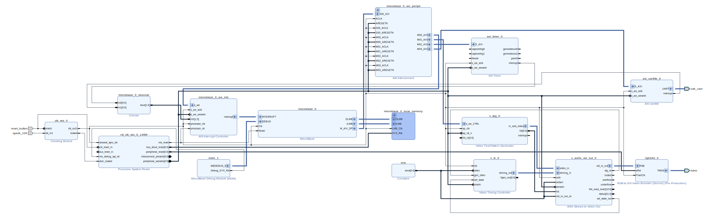

# HDMI Example Project

This project will use a stand-alone Microblaze design to drive the Video Test
Pattern Generator to product HDMI output from the Kintex-7 board.

We will start by making a block design and then write a driver application
for the TestPatternGenerator.

This demo was developed using Vivado 2021.2.

If you are using Windows, you may need to adjust some paths. But forward
slashes do work in Windows as a path separator and have for decades.

## Conventions

We will from time to time use Bash or Tcl commands. These are shown in
fixed font.

Tcl commands start with a `> ` prompt, with the expected output on the
following lines.

    > get_boards
    aliexpress.com:hpc_xc7k325t:1.0 ...

Bash commands start with a `$ ` prompt, with the expected output on the
following lines.

    $ echo "validate_board_files hpc-xc7k325t/1.0" | vivado -mode tcl
    ...
    The board defined in 'hpc-xc7k325t/1.0' is valid.

Elipsis are used frequently to show that extraneous text has be removed.
    

## Prerequisites

You will need the following items to run this test:

 1. A computer running Vivado with a license for the Kintex-7 FPGA.
 1. A 12V power supply to power the board.
 1. A JTAG programmer to progam the device.
 1. A mini-USB cable to connect to the serial port.
 1. A 1080p-capable monitor and an HDMI cable.

### Board Files

This assumes that you have checked out the *STLV7325T FPGA Development Board*
board files and added the path to Vivado.

    > get_boards ali*
    aliexpress.com:hpc_xc7k325t:1.0

### Digilent Library

We also need to clone Digilent's [vivado-library](https://github.com/Digilent/vivado-library) project from GitHub.

    $ git clone https://github.com/Digilent/vivado-library

<div style="page-break-before: always"></div>

## Block Design

In this section we create the block design for the FPGA board and export
the bitstream file.

 1. Start Vivado
 1. Select *Create Project*
 1. Select *Next* in the *New Project* window
 1. Use the `hdmi` for the project name and click *Next*
 1. Select *RTL Project* and click *Next*
 1. Select the *Boards* tab, filter on vendor "aliexpress.com", select the *STLV7325T FPGA Development Board*, and click *Next*
 1. In Vivado, under *IP Integrator*, select *Create Block Design*
 1. Use the name `hdmi_microblaze` in the *Create Block Design* window and click *OK*
 1. In the *BLOCK DESIGN* window, select the *Board* tab
 1. Add the 100MHz system clock. This will add a *Clock Wizard* block.
 1. Before running *Connection Automation*, open the *Clock Wizard*.
 1. Switch to the *Output Clocks* tab.
 1. Change the clk_out1 frequency to 148.5MHz
 1. Change the *Reset Type* to *Active Low*.
 1. Click *OK*.
 1. Click *Run Connection Automation* in the green bar at the top of the *Diagram* window and then click *OK*
 1. Click the *Search* icon in the the *Diagram* window. Search for "Video Test Pattern Generator" and add it to the block desgin.
 1. Search for "Video Timing Controller" and add that to the block design.
 1. Open the *Video Timing Controller* block.
 1. Deselect both "Includ AXI4-lit Interface" and "Enable Detection".
 1. Switch to the *Default/Constant* tab.       
 1. Select "1080p" as the Video Mode and then click "OK".
 1. Search for "AXI4-Stream to Video Out" and add that to the block design.
 1. 
 
 
 1. Search for "Constant" and add that to the block design.
 1. Select the "Constant" block and, in the *Block Properties* window, rename it to "one".
 1. Connect the constant block to the following inputs:
    1. `clken` on the *Video Timing Controller* block
    1. `aclken` on the *AXI4-Stream to Video Out* block
    1. `vid_io_out_ce` on the *AXI4-Stream to Video Out* block
 1. ...
 1. Add an AXI Timer block to the block design.
 1. Connect the interrupt output of the *AXI Timer* to the interrupt concat block.
 1. Add the USB UART from the Blocks tab as an *AXI Uartlite* device.
 1. Connect the interrupt output of the *AXI Uartlite* to the interrupt concat block.
 1. Double-click the *AXI Uartlite* and change the baud rate to 115200.
 1. Add the `hdmi.xdc` file from the board repository.
    1. Click on the `Sources` tab.
    1. Click on the `+` icon.
    1. Select the option for *Add or create constraints* and click *Next*
    1. Click the *Add Files* button.
    1. Find the board repository, then find the `constraints` folder, select `hdmi.xdc` and click *OK*.
    1. Click the *Finish* button.
    1. Open the newly added `hdmi.xdc` file in Vivado.
    1. Comment out the first four entries (`hdmi_cec`, `hdmi_hpd`, `hdmi_scl`, and `hdmi_sda`).
    1. Verify that it matches the *Constraints* below.
    1. Save the changes by pressing Ctrl-S.
 1. Create the wrapper script.
 1. Generate the bitstream.

<div style="page-break-before: always"></div>

### Constraints

These are the `hdmi.xdc` constraints.

```xdc
########### HDMI ##########
#set_property -dict { PACKAGE_PIN M26  IOSTANDARD LVCMOS33 } [get_ports {hdmi_cec}]
#set_property -dict { PACKAGE_PIN N26  IOSTANDARD LVCMOS33 } [get_ports {hdmi_hpd}]
#set_property -dict { PACKAGE_PIN K21  IOSTANDARD LVCMOS33 } [get_ports {hdmi_scl}]
#set_property -dict { PACKAGE_PIN L23  IOSTANDARD LVCMOS33 } [get_ports {hdmi_sda}]
set_property -dict { PACKAGE_PIN R21  IOSTANDARD TMDS_33 } [get_ports {hdmi_clk_p}]
set_property -dict { PACKAGE_PIN P21  IOSTANDARD TMDS_33 } [get_ports {hdmi_clk_n}]
set_property -dict { PACKAGE_PIN N18  IOSTANDARD TMDS_33 } [get_ports {hdmi_data_p[0]}]
set_property -dict { PACKAGE_PIN M19  IOSTANDARD TMDS_33 } [get_ports {hdmi_data_n[0]}]
set_property -dict { PACKAGE_PIN M21  IOSTANDARD TMDS_33 } [get_ports {hdmi_data_p[1]}]
set_property -dict { PACKAGE_PIN M22  IOSTANDARD TMDS_33 } [get_ports {hdmi_data_n[1]}]
set_property -dict { PACKAGE_PIN K25  IOSTANDARD TMDS_33 } [get_ports {hdmi_data_p[2]}]
set_property -dict { PACKAGE_PIN K26  IOSTANDARD TMDS_33 } [get_ports {hdmi_data_n[2]}]
```
 
### Design


 
<div style="page-break-before: always"></div>
 
## Firmware
 
Now that the hardware has been exported, we need to build the firmware that
will run on the Microblaze and configure the test pattern generator.

We are going to assume you do not have an existing Vitis workspace and will
create a new one. If you have an existing one, we assume you are familiar
enough with the tools to work out what to do.

 1. Start Vitis by selecting `Tools | Launch Vitis IDE` in Vivado.
 1. Create a new workspace adjacent to your Vivado project folder called
    `workspace`.
 1. 

<div style="page-break-before: always"></div>

### Code

```cxx
#include <stdio.h>
#include "platform.h"
#include "xil_printf.h"
#include "xv_tpg.h"
#include "xvidc.h"

int main()
{
	XV_tpg tpg;
	XV_tpg_Config* ptpg_config;

    init_platform();

    ptpg_config = XV_tpg_LookupConfig(XPAR_V_TPG_0_DEVICE_ID);
    XV_tpg_CfgInitialize(&tpg, ptpg_config, ptpg_config->BaseAddress);

    u32 status, width, height;

    status = XV_tpg_IsReady(&tpg);
    xil_printf("Ready status %lu\r\n", status);

    status = XV_tpg_IsIdle(&tpg);
    xil_printf(" Idle status %lu\r\n", status);

    XV_tpg_Set_height(&tpg, 1080);
    XV_tpg_Set_width(&tpg, 1920);
    XV_tpg_Set_colorFormat(&tpg, XVIDC_CSF_RGB);
    XV_tpg_Set_maskId(&tpg, 0x00);
    XV_tpg_Set_motionSpeed(&tpg, 0x04);
    XV_tpg_Set_bckgndId(&tpg, XTPG_BKGND_COLOR_BARS);
    XV_tpg_EnableAutoRestart(&tpg);
    XV_tpg_Start(&tpg);

    width = XV_tpg_Get_width(&tpg);
    height = XV_tpg_Get_height(&tpg);

    status = XV_tpg_IsDone(&tpg);
    xil_printf(" Done status %lu\r\n", status);

    xil_printf("Resolution is %lux%lu\r\n", width, height);

    print("Successfully displayed color bars\r\n");
    cleanup_platform();
    return 0;
}
```


